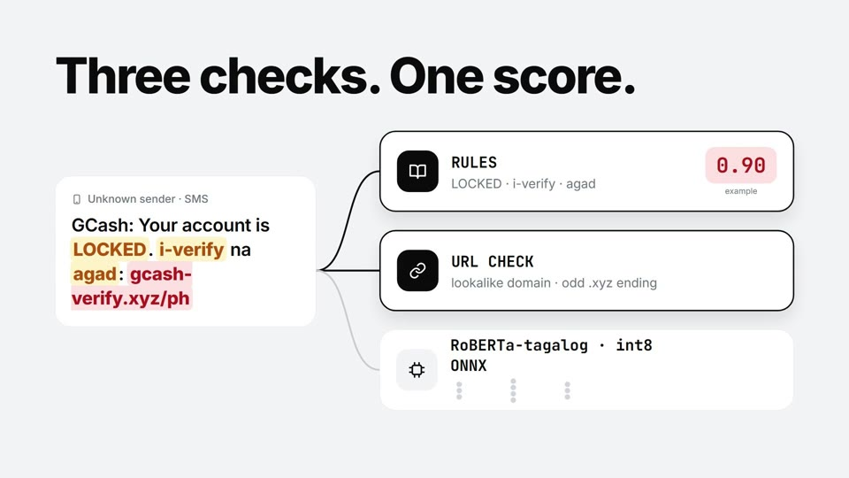
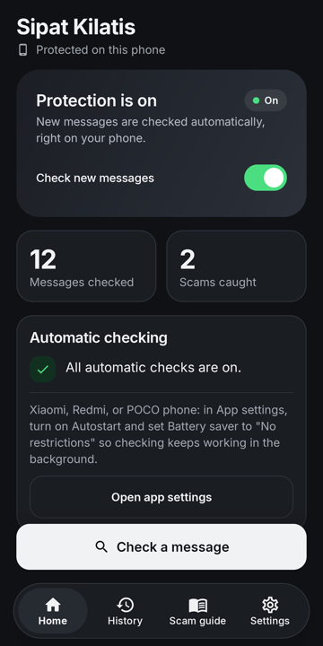
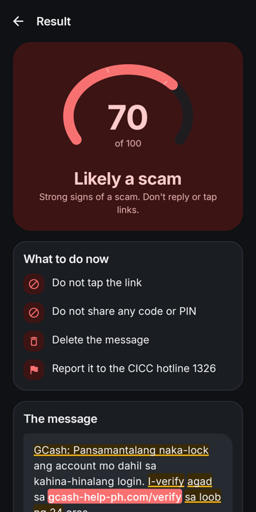
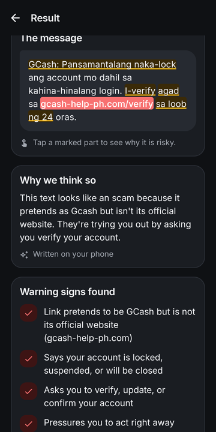

# Sipat Kilatis

**On-device scam (smishing) detector for Filipino SMS and chat messages.**
Works fully offline — your messages never leave your phone.

> *Sipat* (to look closely) + *Kilatis* (to scrutinize, to tell real from fake).

Built for the **AppBuildersPH Hackathon 2026 — Local AI**.

## Demo video

[](video/demo.mp4)

▶️ [Watch the demo video (58 s)](video/demo.mp4)

## Screenshots

Taken on a REDMI Note 15 Pro+ running the release build, fully offline.

<p align="center">
  
  &nbsp;
  
  &nbsp;
  
</p>

<p align="center"><sub><b>Home</b> · <b>Result</b>: verdict, what to do, risky words highlighted · <b>Why</b>: explanation written on the phone by Gemma, plus the warning signs found</sub></p>

---

## The problem

Filipinos get flooded with scam texts: fake GCash / bank "account locked" alerts, parcel "delivery fee"
links, "nanalo ka" prize claims, loan and job offers. These messages arrive in **English, Filipino, and
Taglish**, and generic spam filters (built mostly on English data) miss many of them or can't explain why
a message is dangerous.

There's also a PH-specific blind spot: **local networks strip links from person-to-person SMS**, so many
scam texts that actually reach phones have **no link at all**, only a convincing story ("nanalo ka",
"i-text ang GCash number mo"). Link-based filters miss these. Sipat Kilatis is built to catch them.

## Why it runs locally

| Reason | What it means for the user |
|---|---|
| **Private** | Reading SMS and chat notifications means seeing OTPs, bank alerts, and personal conversations. None of that is uploaded — detection happens entirely on the phone. |
| **Works offline / on prepaid** | Protection doesn't depend on mobile data. It works in airplane mode, in dead zones, and on ₱0 load. |
| **Instant** | Messages are scored the moment they arrive — no upload, no server queue. **~150 ms per message for the full pipeline on a mid-range phone** (Snapdragon 732G). |
| **Free to run** | No per-message cloud API cost, so it can screen every message, all day. |

The app ships **without the `INTERNET` permission** — it physically cannot send your messages anywhere.

**Without local AI, there is no product.** All three models (RoBERTa-Tagalog, TF-IDF classifier, Gemma 3 1B)
run on the phone and there is no cloud fallback. A cloud version would need to upload every SMS, OTP, and
bank alert a user receives — exactly the data a scam-protection app should never send out.

---

## Results

Everything is tested on a **held-out set of 173 real Philippine messages** (109 scam, 64 legit) that
were never used for training.

| What is measured | Size | Precision | Recall | F1 | FPR |
|---|---|---|---|---|---|
| **Full app** (ensemble + rules + URL checks), on the phone — counts SUSPICIOUS or SCAM as a warning | 112 MB | **0.991** | 0.972 | **0.981** | **0.016** |
| TF-IDF + LR alone (ONNX) | 1.5 MB | 0.964 | **0.991** | 0.977 | 0.063 |
| RoBERTa-Tagalog alone (fp32) | 437 MB | 0.947 | 0.982 | 0.964 | 0.094 |
| RoBERTa-Tagalog alone (**int8 ONNX**, on-device) | **110 MB** | 0.955 | 0.982 | 0.968 | 0.078 |

**In plain words (full app):** warns on **106 of 109 scams**, and wrongly warns on only **1 of 64** legit messages.
Each message takes **~37 ms** end to end on a REDMI Note 15 Pro+ (Snapdragon 7s Gen 3).

The full-app row comes from `SystemEvalTest` (`app/src/androidTest`), which runs every test message through the
same `OnDeviceScamDetector` the app uses, at Normal sensitivity. The rules and URL checks turn the ensemble's
5 false alarms into 1, at the cost of 3 missed scams:
- missed: a bare code-style text ("Hello 4 9 3 4 Use it please"), a casino ad written entirely in Chinese, and a
  crypto "kumikita ako ng isang milyon" pitch — all scored just under the SUSPICIOUS line (0.31–0.40)
- false alarm: a real foodpanda delivery-tracking text with a link (flagged SUSPICIOUS)

**Sensitivity setting** (Settings → Sensitivity), measured the same way on the same 173 messages:

| Setting | Scams warned (any level) | Scams at **SCAM** level (pop-up alert) | False alarms (of 64 legit) | F1 |
|---|---|---|---|---|
| Low | 103 / 109 | 1 / 109 | 1 | 0.967 |
| **Normal** (default) | 106 / 109 | 10 / 109 | 1 | 0.981 |
| High | **109 / 109** | **59 / 109** | 3 | **0.986** |

Normal is the default because it keeps false alarms lowest; High catches every scam in the test set and sends
more than half of them as a pop-up SCAM alert, at the cost of 2 more false alarms.

- **Precision**: when the app says *scam*, how often it's right.
- **Recall**: out of all real scams, how many it catches.
- **F1**: one score balancing precision and recall.
- **FPR** (false positive rate): how often a *legit* message is wrongly flagged. **Lower is better.**

Notes:
- int8 quantization shrank RoBERTa **4× (437 → 110 MB) with no loss in accuracy**, and runs at
  **~25 ms per message** on a laptop CPU.
- The test set is small: one message = ~1.6 points of FPR, so the two models are close. They also make
  **different mistakes**, so the app runs **both and averages them** (ensemble), then combines that with
  the rules engine and URL checker (below).

---

## How it works

```
Incoming SMS  ·  chat notification (Messenger, Viber, WhatsApp, GCash, Maya …)  ·  pasted / shared text
        │
        ▼
Preprocessor  ─ lowercase, normalize lookalikes (0→o, 1→l, @→a, $→s …),
                extract URLs, phone numbers, peso amounts
        │
        ▼
Detection engine (all on-device)
  ├─ Rules engine    weighted EN/FIL scam phrases: "account locked", "i-verify",
  │                  "nanalo ka", "delivery fee", OTP requests, urgency ("ngayon na", "agad")
  ├─ URL checker     offline blocklist, lookalike brand domains (gcash, maya, bdo, bpi,
  │                  lbc, jnt, shopee, lazada …), shorteners, raw-IP links, odd TLDs,
  │                  and disguised links (gcash-verify[.]xyz, "(dot)", "bit ly/x")
  └─ ML ensemble     ML = average of RoBERTa-Tagalog (int8 ONNX) + TF-IDF/LR (ONNX),
                     run with ONNX Runtime Android (if one fails to load, the other is used)
        │
        ▼
score = 0.6·ML + 0.25·URL + 0.15·Rules
  + safety rules (see below)

   SAFE  < 0.4  ≤  SUSPICIOUS  < 0.7  ≤  SCAM      (Normal sensitivity)
        │
        ▼
Alert  ─ SCAM: heads-up notification · SUSPICIOUS: normal notification · SAFE: silent
        │
        ▼
Explainer (SUSPICIOUS / SCAM only)
  small local LLM (Gemma ~1B, MediaPipe LLM Inference) explains *why*
  in the user's language; template fallback built from the triggered flags
```

**Safety rules on top of the weighted score:**

| Rule | Why |
|---|---|
| Strong scam phrases (Rules ≥ 0.6) → at least **SCAM**; medium (≥ 0.4) → at least **SUSPICIOUS** | PH networks strip links from person-to-person SMS, so many real scam texts have **no link** — and the ML models (trained mostly on link scams) would score them low. On the dataset, **0 of 1,864 legit messages** reach the medium rule level. |
| Every link goes to an official site (gcash.com, lazada.com.ph, zoom.us …) and no strong phrases → capped at **SAFE** | Prevents false alarms on legit bank, shop, and meeting messages: almost every link in the training data was a scam link, so the ML score alone rises for *any* link. This cap fixes that. (All of google.com / facebook.com do **not** count as official — anyone can publish forms and pages there.) |
| Link on the offline blocklist → at least **0.9 (SCAM)** | Known scam domains are always flagged. |

**Sensitivity setting** shifts the SUSPICIOUS / SCAM thresholds: Low 0.5 / 0.8 · Normal 0.4 / 0.7 · High 0.3 / 0.6.

---

## Project status

| Phase | Component | Status |
|---|---|---|
| 0 | Project setup (Android + Python ML monorepo) | ✅ Done |
| 1 | Data prep + TF-IDF / LR baseline + ONNX export | ✅ Done |
| 2 | RoBERTa-Tagalog fine-tune + int8 ONNX export | ✅ Done |
| 3 | Android app skeleton and screens (English + Filipino) | ✅ Done |
| 4 | On-device detection engine (rules + URL checker + RoBERTa / baseline ensemble) | ✅ Done |
| 5 | SMS + chat screening, scam alerts, rule floors, disguised links, official-link cap | ✅ Done |
| 6 | Local LLM explainer (Gemma 3 1B via MediaPipe, GPU) with safety check + template fallback | ✅ Done |
| 7 | Room database (history, feedback, trusted contacts), masked report export, clear history | ✅ Done — the optional online blocklist update was deliberately skipped (the app has no internet permission) |
| 8 | Demo set + hidden demo mode, app review, release APK (R8), demo script, README | ✅ Done |

**What the Android app does today:**
- **Screens real messages automatically, fully offline:**
  - incoming **SMS** (`SmsReceiver`)
  - notifications from **Messenger, Messenger Lite, Viber, WhatsApp, GCash, Maya** and the default SMS app
    (`MessageNotificationListener`)
  - duplicate messages within 10 seconds are only checked once
- **Scam alerts:** SCAM → high-priority heads-up notification · SUSPICIOUS → normal notification · SAFE → silent.
  Alerts have **View details** and **Mark as safe** actions, and Android's automatic "Open link" button is turned off.
- **Manual check:** paste a message, or **Share → Sipat Kilatis** from any app.
- **Result screen** highlights the suspicious parts of the message and lists the reasons.
- **AI explanation on the phone:** for SUSPICIOUS / SCAM, Gemma 3 1B (on the phone's GPU) writes a short explanation.
  It is shown only if it finishes within 20 s and passes a safety check; otherwise a built-in template explanation
  is shown. Measured on a Snapdragon 732G: ~10 s to load (once), ~11 s per explanation.
- **History saved on the phone** (Room): survives restarts, with search and verdict filters. **Mark as safe** /
  **Report scam** on every result; **Export my reports** saves a CSV with numbers, emails, and names masked, which
  you share yourself. **Clear history** in Settings.
- **Hidden demo mode:** Settings → tap the version number 5 times. Runs the 10 demo messages
  (`docs/demo_messages.md`) through the detector: 10/10 as expected, ~150 ms each on a mid-range phone.
- Screens: Onboarding · Home dashboard · Check a message · Result · History · Scam guide · Settings
  (sensitivity, protection on/off, permissions).
- Full **English and Filipino** UI, switchable per app.
- Permissions used: `RECEIVE_SMS`, notification access, `POST_NOTIFICATIONS`. **No `INTERNET` permission.**

---

## Repository layout

```
Sipat-Kilatis/
├── app/                          Android app (Kotlin, Jetpack Compose, Material 3)
│   ├── src/main/java/com/example/sipatkilatis/
│   │   ├── SipatApp.kt           app-wide singletons (detector, repo, prefs, alerts, screener)
│   │   ├── capture/              SmsReceiver, MessageNotificationListener, MessageScreener, ScamAlerts
│   │   ├── detection/            OnDeviceScamDetector, Preprocessor, RegexRulesEngine, OfflineUrlChecker,
│   │   │                         OnnxClassifiers (ensemble), RobertaTokenizer, TextNormalizer, RiskScorer
│   │   ├── ui/                   screens, components, theme, AppNavHost, MainViewModel
│   │   ├── data/                 scan repository, app preferences
│   │   └── model/                data classes
│   └── src/main/assets/          blocklist.txt, tokenizer/ (+ ONNX models, git-ignored)
├── gradle/, build.gradle.kts, settings.gradle.kts
├── ml/                           Python: data prep, training, model export
│   ├── data/raw/                 raw dataset (not committed — contains real messages)
│   ├── data/processed/           cleaned, merged dataset (messages.csv, not committed)
│   ├── models/                   configs, metrics, test vectors (model binaries git-ignored)
│   ├── text_normalize.py         shared normalize() — must be mirrored on Android
│   ├── prepare_data.py           raw xlsx → messages.csv
│   ├── train_baseline.py         TF-IDF + LR → baseline.onnx
│   ├── predict_baseline.py       run the baseline ONNX model from the command line
│   ├── train_transformer.py      fine-tune RoBERTa-Tagalog
│   ├── train_transformer_colab.ipynb   same, on a free Colab GPU
│   ├── export_onnx.py            RoBERTa → ONNX → int8
│   ├── reference_inference.py    exact inference steps the Android app must copy
│   ├── requirements.txt
│   └── setup_venv.ps1 / setup_venv.sh
├── docs/                         notes and write-ups
└── CLAUDE.md                     full architecture spec (weights and thresholds live here)
```

---

## ML pipeline

### 1. Data preparation — `prepare_data.py`

Input: `ml/data/raw/spam_ham_dataset_updated (1).xlsx` (no header; column A = label, column B = text).
The file is a concatenation of blocks — **UCI | real PH | UCI | synthetic PH | real PH (tail)** — and the
script finds block boundaries from anchor messages rather than guessing from content.

Steps:
1. Map labels (`spam` → `scam`), clean HTML / line breaks, drop empty and `<<Content not supported.>>` rows.
2. Flip the **inverted labels** in the synthetic PH block.
3. **Deduplicate on a template key** (names, codes, amounts, digits → placeholders); majority label wins on conflicts.
4. Relabel pure OTP-delivery messages (code only, no ask to send/reply/share, no link) as **ham**.
5. Down-sample UCI ham to 1,500 rows; weight real PH rows **2×**.
6. Split: **test = stratified 20% of real PH messages only**; **val = 10%** of the remaining rows (all sources).

Output: `ml/data/processed/messages.csv` — `text, label, source, weight, split, raw_row`.

### 2. Shared normalization — `text_normalize.py`

`normalize()` strips the `<REAL NAME>` anonymization marker, lowercases, and replaces URLs, peso amounts,
and numbers with `urltoken` / `amttoken` / `numtoken`. It runs **before both models**, and the Android
preprocessor must match it exactly (checked against the test vectors in `ml/models/`).

### 3. Baseline — `train_baseline.py`

- TF-IDF on **word 1–2-grams + character 2–5-grams** (catches misspellings like "G-Cash", "acc0unt")
  + `LogisticRegression` (`class_weight="balanced"`).
- Reports test metrics on real PH messages, CV metrics per source, and a **language-shortcut check**
  (false positive rate on Tagalog/Taglish vs English legit messages, so the model doesn't learn "Tagalog = scam").
- Exports `models/baseline.onnx` (skl2onnx, string input) + `baseline_config.json` + `baseline_test_vectors.json`.
  Uses the `com.microsoft` Tokenizer op, so it needs the full `onnxruntime-android` package.

### 4. Transformer — `train_transformer.py` + `export_onnx.py`

- Fine-tunes `jcblaise/roberta-tagalog-base` (max length 128, best epoch picked by validation F1).
  No NVIDIA GPU? Use `train_transformer_colab.ipynb` on a free Colab T4.
- `export_onnx.py`: Optimum ONNX export → dynamic **int8** quantization →
  `models/scam_classifier_int8.onnx` (~110 MB) + `models/tokenizer/` + `models/test_vectors.json`.
- Inputs `input_ids` + `attention_mask`; output logits, softmax index 1 = P(scam).
  `reference_inference.py` shows the exact steps for Android.

Metrics are saved in `ml/models/baseline_config.json`, `transformer_metrics.json`, and `transformer_export.json`.

---

## Getting started

### ML (Python)

Place the raw dataset at `ml/data/raw/spam_ham_dataset_updated (1).xlsx` first (raw data is not committed).

```powershell
# Windows
cd ml
.\setup_venv.ps1                                  # installs CUDA PyTorch if an NVIDIA GPU is present
.\.venv\Scripts\python.exe prepare_data.py
.\.venv\Scripts\python.exe train_baseline.py
.\.venv\Scripts\python.exe predict_baseline.py "GCash: account locked, i-verify agad sa gcash-ph.xyz"
.\.venv\Scripts\python.exe train_transformer.py
.\.venv\Scripts\python.exe export_onnx.py
```

```bash
# macOS / Linux
cd ml
./setup_venv.sh
.venv/bin/python prepare_data.py
.venv/bin/python train_baseline.py
.venv/bin/python train_transformer.py
.venv/bin/python export_onnx.py
```

### Android

1. Open the repository root in **Android Studio** and let Gradle sync.
2. Run the `app` configuration on a device or emulator.
3. Or build from a terminal:
   ```powershell
   $env:JAVA_HOME = "C:\Program Files\Android\Android Studio\jbr"; .\gradlew.bat assembleDebug
   ```
4. Copy the trained models from `ml/models/` into `app/src/main/assets/` (`baseline.onnx`,
   `scam_classifier_int8.onnx`; git-ignored). The tokenizer files and `blocklist.txt` are already there.
   If a model is missing, the app falls back to the other model, or to rules + URL checks only.
5. *(Optional, for AI explanations)* Download `gemma3-1b-it-int4.task` (555 MB) from
   [litert-community/Gemma3-1B-IT](https://huggingface.co/litert-community/Gemma3-1B-IT) (accept the Gemma license),
   install the app once, then push the model to the phone:
   ```powershell
   adb push "$env:USERPROFILE\Downloads\gemma3-1b-it-int4.task" /sdcard/Android/data/com.example.sipatkilatis/files/llm/model.task
   ```
   Uninstalling the app deletes this file. Without it, the app uses template explanations.

**Install the release APK** (R8-shrunk, ~235 MB, signed with the debug key for sideloading — not for the Play Store):

```powershell
.\gradlew.bat assembleRelease
adb install -r app\build\outputs\apk\release\app-release.apk
```

On Xiaomi / Redmi / POCO phones, also turn on **Autostart** and set **Battery saver → No restrictions** for the app,
otherwise MIUI may stop SMS screening in the background. On Android 13+, a sideloaded APK (not installed through
adb / Android Studio) needs App info → ⋮ → **Allow restricted settings** before chat-app screening can be enabled.

**Tests**

```powershell
# Unit tests: normalizer + tokenizer parity with Python, rule / URL messages, risk scorer
.\gradlew.bat testDebugUnitTest

# On an emulator: both ONNX models vs the Python test vectors (within 0.02), end-to-end timing
$env:ANDROID_SERIAL = "emulator-5554"; .\gradlew.bat connectedDebugAndroidTest

# On a phone with the Gemma model: explanation speed, safety check, overlapping requests (no crash).
# Use adb directly: Gradle's connected tests uninstall the app, which deletes the pushed model.
.\gradlew.bat assembleDebug assembleDebugAndroidTest
adb install -r app\build\outputs\apk\debug\app-debug.apk
adb install -r app\build\outputs\apk\androidTest\debug\app-debug-androidTest.apk
adb shell am instrument -w -e class com.example.sipatkilatis.detection.LlmOnDeviceTest com.example.sipatkilatis.test/androidx.test.runner.AndroidJUnitRunner

# Full-app accuracy on the 173 test messages (needs ml/data/processed/messages.csv and both ONNX models).
# Run once without the CSV so the app creates eval/ itself, then push the CSV and run again.
adb shell am instrument -w -e class com.example.sipatkilatis.detection.SystemEvalTest com.example.sipatkilatis.test/androidx.test.runner.AndroidJUnitRunner
adb push ml\data\processed\messages.csv /sdcard/Android/data/com.example.sipatkilatis/files/eval/messages.csv
adb shell am instrument -w -e class com.example.sipatkilatis.detection.SystemEvalTest com.example.sipatkilatis.test/androidx.test.runner.AndroidJUnitRunner
adb shell cat /sdcard/Android/data/com.example.sipatkilatis/files/eval/system_eval_normal.txt
# Other levels: add  -e sensitivity LOW  or  -e sensitivity HIGH  to the am instrument command

# Run demo mode from a computer and read the results from the log
adb shell am start -n com.example.sipatkilatis/.MainActivity --ez open_demo true
adb logcat -s SipatKilatis | findstr DEMO
```

**Demo:** see `docs/DEMO_SCRIPT.md` (3-minute flow + 5-slide pitch outline) and `docs/demo_messages.md`.

**Try a scam SMS on the emulator** (open the app once first, then press Home):

```powershell
adb -s emulator-5554 emu sms send 09171234567 "GCash: Na-lock ang account mo. I-verify agad sa gcash-verify.xyz"
```

- Package: `com.example.sipatkilatis`
- Kotlin · Jetpack Compose · Material 3 · AGP 9 · KSP (Room)
- minSdk 26 · targetSdk 34 · compileSdk 37

---

## Disclosure (hackathon requirement)

**Models**
- `jcblaise/roberta-tagalog-base` — fine-tuned on our data, exported to int8 ONNX
- TF-IDF + logistic regression (scikit-learn) — exported to ONNX; averaged with RoBERTa on-device (ensemble)
- Gemma 3 1B IT (int4, `gemma3-1b-it-int4.task` from [litert-community/Gemma3-1B-IT](https://huggingface.co/litert-community/Gemma3-1B-IT),
  Gemma license) — run on the phone GPU with the MediaPipe LLM Inference API to write explanations

**Frameworks and libraries**
- Python: scikit-learn, pandas, openpyxl, PyTorch, Hugging Face Transformers / Datasets / Optimum / Accelerate / Evaluate, ONNX, ONNX Runtime, skl2onnx
- Android: Kotlin, Jetpack Compose, Material 3, Navigation Compose, AppCompat, Kotlin Coroutines, Room, ONNX Runtime Android, MediaPipe Tasks GenAI

**Datasets** (merged, cleaned, and deduplicated by `prepare_data.py`; the merged file is not published because it
contains real messages)

*SMS scam / spam messages*
- [UCI SMS Spam Collection](https://archive.ics.uci.edu/dataset/228/sms+spam+collection) (Almeida & Hidalgo),
  also via [Sarthakdwivedi78/Sms-Email-spam-classifier](https://github.com/Sarthakdwivedi78/Sms-Email-spam-classifier/blob/main/spam.csv)
- [Yissuh/Filipino-Spam-SMS-Detection-Model](https://github.com/Yissuh/Filipino-Spam-SMS-Detection-Model)
  — `data-set.csv`, `merged-set.csv` (BSD-3-Clause)
- [AGR-Yes/ScamMessagesPhilippines](https://github.com/AGR-Yes/ScamMessagesPhilippines)
  — `Raw Datasets/SPAM_SMS.csv`, `Raw Datasets/Scam_SMS_Reports.xlsx`
- [jamesjmnz/AIlagmatha](https://github.com/jamesjmnz/AIlagmatha) — `scam_dataset.csv`, `scam_dataset_test.csv`
- Synthetic Philippine message templates

*Phishing URLs*
- [0xp0tato/Phishing-Url-Detection-Using-Machine-Learning](https://github.com/0xp0tato/Phishing-Url-Detection-Using-Machine-Learning/blob/master/dataset.csv)
- [Phishing Dataset (UCI ML, CSV)](https://www.kaggle.com/datasets/isatish/phishing-dataset-uci-ml-csv) on Kaggle

*Reference*
- [GCash Help Center](https://help.gcash.com/hc/en-us) — official GCash domains and scam warnings

Personal names in the real messages are replaced with `<REAL NAME>`. Except where noted, the source repositories
state no license; they are credited here and their data is not redistributed.

**Pre-existing code / assets**
- Code: none — the repository was created at the start of the hackathon (see the commit history).
- Assets: only the open-source models and datasets listed above.

**Cloud APIs**
- None. Google Colab is an optional training environment only; the app itself never calls a cloud service.

**AI-assisted development**
- Claude Code

---

## Known limitations

- **Small test set:** 173 held-out real PH messages. One message moves FPR by ~1.6 points, so treat the
  scores as a strong first result, not a final benchmark.
- **On Normal sensitivity, most scams are labelled SUSPICIOUS, not SCAM:** only 10 of 109 test scams reach the
  SCAM level (pop-up alert); the rest get a SUSPICIOUS warning (normal notification). High sensitivity raises this
  to 59 of 109, with 3 false alarms instead of 1 (see Results).
- **Sample blocklist:** `blocklist.txt` is a short hackathon list; there is no online update (by design — no internet permission).
- **Gemma is slow on mid-range phones:** ~10 s to load once, ~11 s per explanation. The template explanation
  is shown instantly meanwhile.
- **Large app:** ~235 MB release APK (RoBERTa is 110 MB), plus the optional 555 MB Gemma model.
- **Sideloading friction:** Play Protect warns about an app that reads SMS, and Android 13+ requires
  **Allow restricted settings** before notification access can be granted.
- **Only screens what Android lets it see:** messages hidden or removed by carrier or phone spam filters
  never reach the app.

---

## Team: LFInternship
- Ahl B. Satingin
- Jerwin L. Alvarez
- Jenelle G. Salcedo
- Matthew Christian A. Quisao
